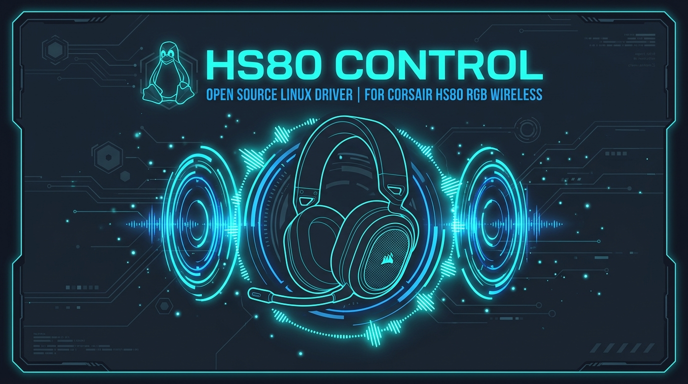
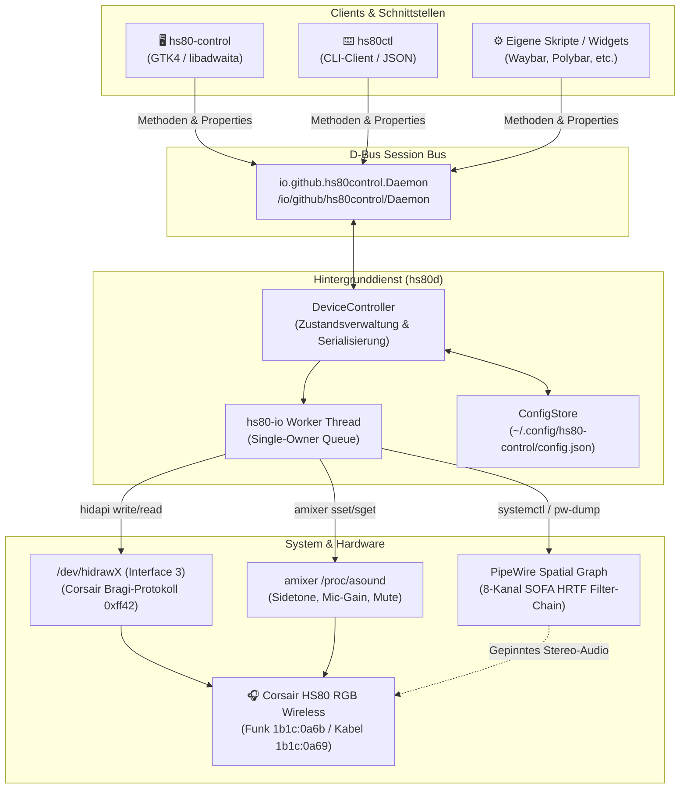
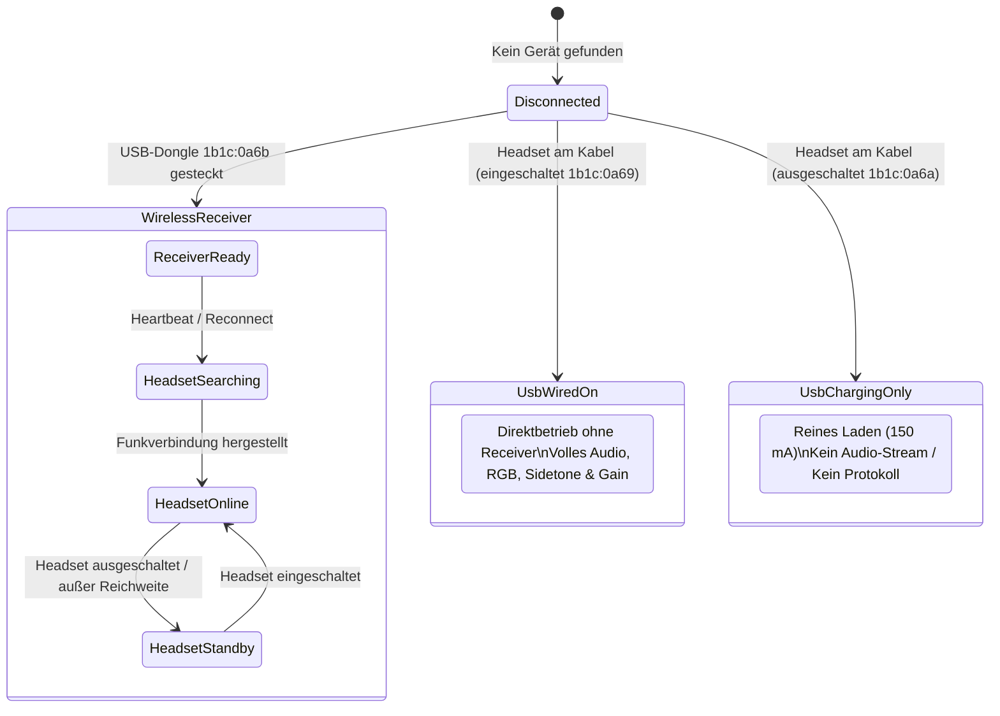
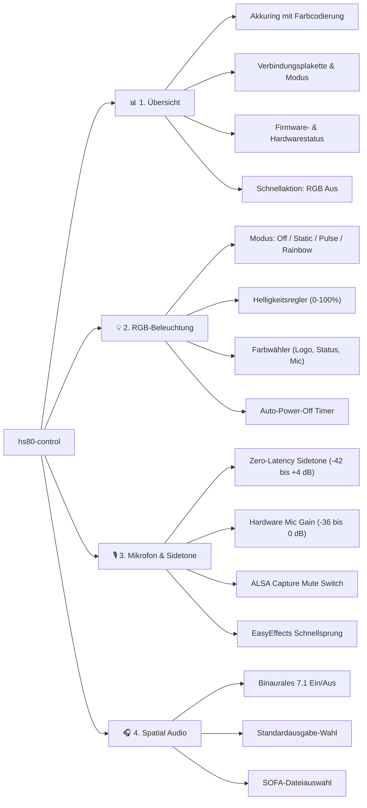
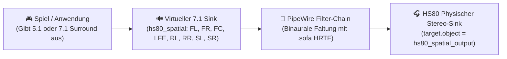
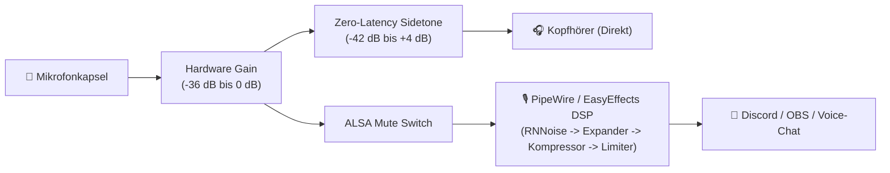

<p align="center">
  
</p>

# HS80 Control — Native Linux-Treiber & Steuerung für das Corsair HS80 RGB Wireless

[](https://github.com/ST1CKEL/HS80_Control/actions/workflows/check.yml)
[](LICENSE)
[](https://www.python.org/)
[](https://gnome.pages.gitlab.gnome.org/libadwaita/)
[](https://pipewire.org/)
[](https://fedoraproject.org/)

**HS80 Control** ist eine performante, native Linux-Lösung zur vollständigen Steuerung des **Corsair HS80 RGB Wireless** Gaming-Headsets. Sowohl der kabellose Funkbetrieb über den mitgelieferten USB-Transceiver (`1b1c:0a6b`) als auch der direkte Kabelbetrieb (`1b1c:0a69`) werden nativ und ohne Windows oder iCUE unterstützt.

Die Suite umfasst einen leichtgewichtigen Hintergrunddienst (`hs80d`), eine asynchrone D-Bus-Schnittstelle, ein skriptfähiges Kommandozeilenwerkzeug (`hs80ctl`) und eine moderne, adaptive GTK4/libadwaita-Benutzeroberfläche (`hs80-control`), die sich nahtlos in moderne Desktop-Umgebungen (GNOME, KDE Plasma, etc.) unter Wayland und X11 einfügt.

---

## Inhaltsverzeichnis

- [Funktionsübersicht](#funktionsübersicht)
- [Screenshots](#screenshots)
- [Systemarchitektur](#systemarchitektur)
- [Hardware-Kompatibilität & Verbindungsmodi](#hardware-kompatibilität--verbindungsmodi)
- [Systemanforderungen](#systemanforderungen)
- [Installation & Schnellstart](#installation--schnellstart)
  - [Benutzerinstallation (Empfohlen)](#benutzerinstallation-empfohlen)
  - [Systemweite Installation](#systemweite-installation)
  - [Direktausführung aus dem Quellverzeichnis](#direktausführung-aus-dem-quellverzeichnis)
- [Kommandozeilen-Referenz (hs80ctl)](#kommandozeilen-referenz-hs80ctl)
- [Grafische Oberfläche (hs80-control)](#grafische-oberfläche-hs80-control)
- [Spatial Audio (Binaurales 7.1 HRTF Surround)](#spatial-audio-binaurales-71-hrtf-surround)
- [Mikrofonsteuerung & DSP](#mikrofonsteuerung--dsp)
- [D-Bus-Schnittstelle](#d-bus-schnittstelle)
- [Protokoll & Reverse Engineering](#protokoll--reverse-engineering)
- [Fehlerbehebung & Diagnose (Doctor)](#fehlerbehebung--diagnose-doctor)
- [Entwicklung, Tests & Paketbau](#entwicklung-tests--paketbau)
- [Lizenz & Haftungsausschluss](#lizenz--haftungsausschluss)

---

## Funktionsübersicht

- 🔋 **Echtzeit-Akkumonitoring**: Exakte prozentuale Ladestandsabfrage und dynamische Ladeanzeige über Hardware-Events und Heartbeats.
- 💡 **Umfassende RGB-Steuerung**: 4 Modi (*Aus*, *Statisch*, *Pulsieren*, *Regenbogen*) mit feinstufiger Helligkeitsregelung und getrennt ansteuerbaren Farbzonen (*Logo*, *Statusanzeige*, *Mikrofon-LED*).
- ⏱️ **Einstellbarer Sleep-Timer**: Automatische Abschaltung bei Inaktivität nach 0 bis 90 Minuten.
- 🎙️ **Hardware-Sidetone (Zero-Latency Mic Monitoring)**: Direktes, latenzfreies Mithören des eigenen Mikrofons über ALSA im Bereich von `-42 dB` bis `+4 dB`.
- 🎚️ **Hardware-Mikrofonverstärkung & Mute**: Gain-Regelung von `-36 dB` bis `0 dB` sowie ALSA-Aufnahmestummschaltung.
- 🎧 **Binaurales PipeWire 7.1 Spatial Audio**: Virtuelle 8-Kanal-Surround-Faltung auf Stereo mittels SOFA-HRTF-Filterketten (`pipewire-module-filter-chain-sofa`).
- 🔄 **Intelligenter Reconnect & Hotplug**: Schneller Neuaufbau der Funkverbindung auf Knopfdruck bei eingeschaltetem Headset ohne Dienstneustart.
- 🔌 **Direkter Kabelbetrieb**: Automatische Erkennung des Headsets am USB-Kabel (`1b1c:0a69`) mit voller Audio- und Steuerfunktionalität ohne USB-Dongle.
- ⚡ **Ladekabel-Zustandserkennung**: Präzise Diagnose von `1b1c:0a6a` (ausgeschaltetes Headset lädt nur am Kabel).
- 🎨 **Adaptive GTK4/libadwaita GUI**: Automatische Anpassung an Dark/Light-Systemfarben und Fensterbreiten, System-Akzentfarben und Live-Benachrichtigungen.
- 🤖 **Vollständige D-Bus API & JSON-Support**: Perfekt für Automatisierung, Desktop-Widgets, Waybar/Polybar und Skripte.

---

## Screenshots

Die Benutzeroberfläche folgt automatisch dem Hell-/Dunkel-Farbschema sowie den Akzentfarben des Systems (hier dargestellt unter KDE Plasma im dunklen Design):

| Übersicht & Gerätestatus | RGB-Beleuchtung & Zonen |
| :---: | :---: |
|  |  |
| *Verbindungsplakette, Akkuring, Firmware & Statuskarten* | *Farbwähler für Logo, Status & Mic sowie Sleep-Timer* |

| Mikrofon, Sidetone & Gain | Binaurales 7.1 Spatial Audio |
| :---: | :---: |
|  |  |
| *Latenzfreier Sidetone, Hardware-Gain & EasyEffects-Sprung* | *SOFA-HRTF Raumklang-Faltung & Standardausgabe-Wahl* |

---

## Systemarchitektur

Das folgende Diagramm visualisiert das Zusammenspiel der Komponenten:



### Kernprinzipien des Treibers

1. **Kein Root-Dienst erforderlich**: Der Dienst läuft vollständig in der `systemd --user`-Benutzersitzung. Die udev-Regel (`uaccess`) erteilt dem angemeldeten Benutzer die Rechte für Interface 3.
2. **Exklusiver I/O-Worker-Thread (`hs80-io`)**: Alle HID-Schreib- und Lesezugriffe laufen serialisiert über einen einzigen Worker. Dadurch werden Race-Conditions und verlorene Antwortpakete zwischen RGB-Updates, Heartbeats und Benutzerbefehlen ausgeschlossen.
3. **Saubere Trennung von Audio und Steuerung**: Die Audio-Klasseninterfaces (0, 1, 2) und Medien-Tasten (Interface 4) verbleiben unberührt beim Kernel-Treiber `snd-usb-audio`. Es finden keine Interface-Claims oder Driver-Detaches statt.
4. **Atomare Konfiguration**: Einstellungen werden sicher und atomar in `~/.config/hs80-control/config.json` persistiert.

---

## Hardware-Kompatibilität & Verbindungsmodi

HS80 Control unterstützt gezielt die folgenden Hardware-Konfigurationen:

| Verbindungsart | USB Vendor & Product ID | Status | Anmerkungen |
| :--- | :--- | :---: | :--- |
| **Funkempfänger (Wireless)** | Receiver `1b1c:0a6b`, interne Headset-PID `0a69` | ✅ **Voll unterstützt** | An echter Hardware validiert. Headset wird drahtlos über Dongle gesteuert. |
| **Direkt am USB-Kabel (eingeschaltet)** | Headset `1b1c:0a69` | ✅ **Voll unterstützt** | An echter Hardware validiert. Kein Dongle erforderlich; Steuerung, RGB, Sidetone & Audio laufen direkt über Kabel. |
| **Am USB-Ladekabel (ausgeschaltet)** | Headset `1b1c:0a6a` | ℹ️ **Statusanzeige** | Reines Laden (150 mA). Das Headset bietet in diesem Zustand weder Audioklasse noch Steuerprotokoll. Wird von der App diagnostiziert. |
| **Alternative interne PID (Wireless)** | Receiver `1b1c:0a6b`, interne Headset-PID `0a71` | 🔬 *Experimentell* | Im Protokollcode integriert; wartet auf Feedback aus der Community. |
| **HS80 MAX / HS80 Wired / Bluetooth** | abweichende IDs | ❌ *Nicht unterstützt* | Verwendet andere Protokolle/Transceiver. |

### Verbindungsfluss & Betriebsmodi



---

## Systemanforderungen

| Komponente | Empfohlene Mindestversion | Zweck |
| :--- | :--- | :--- |
| **Betriebssystem** | Linux mit `systemd --user` | z. B. Fedora 44, Ubuntu 24.04+, Arch Linux, Debian 13+ |
| **Python** | Python ≥ 3.11 | Laufzeitumgebung für Dienst, CLI und GUI |
| **GUI-Bibliotheken** | `gtk4`, `libadwaita` ≥ 1.7 (Fedora 44: 1.9+) | Moderne Benutzeroberfläche |
| **D-Bus** | `python3-dbus-next` | Asynchrone IPC-Kommunikation |
| **HID & udev** | `hidapi` (hidraw-Backend), `systemd-udev` | Lese-/Schreibzugriff auf USB-Interface 3 |
| **Audio-Server** | `pipewire`, `wireplumber`, `alsa-utils` | Audio-Routing, Sidetone- und Gain-Regler |
| **Spatial Audio** | `pipewire-module-filter-chain-sofa` | SOFA-HRTF Faltung für virtuelles 7.1 |
| **DSP (Optional)** | `easyeffects` | RNNoise-Rauschunterdrückung, Noise-Gate, Kompressor |

### Paketinstallation unter Fedora

```bash
sudo dnf install python3 python3-dbus-next python3-gobject gtk4 libadwaita \
  hidapi alsa-utils pipewire pipewire-utils wireplumber
```

Für Spatial Audio (optional):
```bash
sudo dnf install pipewire-module-filter-chain-sofa
```

---

## Installation & Schnellstart

### Benutzerinstallation (Empfohlen)

Die Anwendung und der systemd-User-Dienst benötigen zur Ausführung **keine Root-Rechte**:

```bash
# 1. Repository klonen
git clone https://github.com/ST1CKEL/HS80_Control.git
cd HS80_Control

# 2. Im Benutzerverzeichnis (~/.local/) installieren
make install-user

# 3. Einmalig die udev-Regel für USB-Rechte systemweit einrichten
sudo install -Dm0644 data/udev/70-hs80-control.rules /usr/lib/udev/rules.d/70-hs80-control.rules
sudo udevadm control --reload-rules && sudo udevadm trigger

# 4. Receiver kurz abziehen und wieder anstecken
```

Nach dem Anstecken startet der Dienst automatisch. Überprüfen Sie den Status:

```bash
hs80ctl status
hs80-control
```

*Hinweis:* Stellen Sie sicher, dass `~/.local/bin` in Ihrer `$PATH`-Umgebungsvariable enthalten ist.

Zum Deinstallieren der Benutzerinstallation:
```bash
make uninstall-user
```

---

### Systemweite Installation

Für Paketbauer oder systemweite Einrichtung:

```bash
sudo make install
sudo udevadm control --reload-rules && sudo udevadm trigger
systemctl --user daemon-reload
systemctl --user enable --now hs80d.service
```

---

### Direktausführung aus dem Quellverzeichnis

Sie können das Projekt auch direkt aus dem Arbeitsverzeichnis testen:

```bash
# Terminal 1: Daemon starten
./bin/hs80d --debug

# Terminal 2: CLI-Befehle ausführen
./bin/hs80ctl status

# Oder grafische Oberfläche starten
./bin/hs80-control
```

---

## Kommandozeilen-Referenz (hs80ctl)

`hs80ctl` bietet volle Kontrolle über alle Funktionen und unterstützt maschinenlesbare JSON-Ausgaben (`--json`) für Skripte und Desktop-Widgets.

```text
Aufruf: hs80ctl [--json] <Befehl> [Optionen]
```

### Befehlsübersicht

| Befehl | Parameter | Beschreibung |
| :--- | :--- | :--- |
| `status` | — | Zeigt den aktuellen Zustand von Headset, Akku, RGB, Mixer und Spatial Audio an. |
| `reconnect` | — | Trennt die bestehende HID-Sitzung und baut die Funkverbindung sofort neu auf. |
| `refresh` | — | Erzwingt eine Aktualisierung von Akku-, Mikrofon- und ALSA-Mixer-Werten. |
| `doctor` | — | Überprüft lokale Systemvoraussetzungen (USB, hidraw, ALSA, PipeWire, SOFA). |
| `rgb` | `<modus> [Optionen]` | Setzt RGB-Modus (`off`, `static`, `pulse`, `rainbow`), Helligkeit und Zonenfarben. |
| `sleep` | `<0..90>` | Konfiguriert den automatischen Abschalttimer in Minuten (`0` = deaktiviert). |
| `sidetone` | `<on\|off> [--db -42..4]` | Schaltet Hardware-Monitoring ein/aus und setzt den Pegel in dB. |
| `mic-gain` | `<-36..0>` | Stellt die Hardware-Mikrofonverstärkung in dB ein. |
| `mic-mute` | `<on\|off>` | Schaltet die ALSA-Aufnahmestummschaltung. |
| `spatial` | `<on\|off\|configure\|default>` | Steuert binaurales 7.1 Virtual Surround und SOFA-Dateien. |

### Anwendungsbeispiele

```bash
# 1. Gerätestatus abfragen
hs80ctl status

# 2. Status als JSON für Skripte (Waybar, Polybar, Home Assistant)
hs80ctl status --json

# 3. Statische RGB-Beleuchtung (Cyan Logo, Weißer Status, Grün am Mic, 50% Helligkeit)
hs80ctl rgb static --brightness 50 --logo '#00bfff' --indicator '#ffffff' --microphone '#00ff00'

# 4. Beleuchtung komplett ausschalten (spart Akku)
hs80ctl rgb off

# 5. Regenbogeneffekt aktivieren
hs80ctl rgb rainbow --brightness 80

# 6. Hardware-Sidetone (Mikrofon-Monitoring) auf -18 dB einschalten
hs80ctl sidetone on --db -18

# 7. Mikrofonverstärkung auf -6 dB setzen
hs80ctl mic-gain -6

# 8. Sleep-Timer auf 30 Minuten setzen
hs80ctl sleep 30

# 9. Spatial 7.1 mit einer SOFA-HRTF konfigurieren und aktivieren
hs80ctl spatial configure ~/HRTF/kemar_elev0.sofa
hs80ctl spatial default on
hs80ctl spatial on

# 10. Verbindung neu aufbauen (nach Einschalten des Headsets)
hs80ctl reconnect
```

---

## Grafische Oberfläche (hs80-control)

Die GTK4/libadwaita-Anwendung gliedert sich in vier intuitiv bedienbare Seiten:



### Besondere Merkmale der UI

- **Adaptive Breakpoints**: Ab einer Fensterbreite unter `600sp` wandert der Ansichten-Umschalter von der Kopfleiste automatisch in eine kompakte Fußleiste.
- **Dynamischer Akkuring**: Visualisiert den Ladezustand farblich angepasst (unter 20 % Warnfarbe, beim Laden Erfolgsfarbe, ansonsten System-Akzentfarbe).
- **Mute-Suppression Banner**: Erkennt, wenn das Mikrofon hochgeklappt ist, und weist darauf hin, dass die Firmware in diesem Zustand Beleuchtungsänderungen erst nach dem Herunterklappen anzeigt.
- **Live D-Bus Synchronisation**: Ändern sich Einstellungen über CLI, Skripte oder Hardware-Tasten, aktualisiert sich die Oberfläche verzögerungsfrei in Echtzeit.

---

## Spatial Audio (Binaurales 7.1 HRTF Surround)

Das Corsair HS80 ist physisch ein hochwertiges Stereo-Headset. Für echtes Raumklang-Erlebnis in Spielen erzeugt **HS80 Control** über PipeWire ein virtuelles 7.1-Audiogerät (`hs80_spatial`) und faltet dessen 8 diskrete Audiokanäle über eine **SOFA-HRTF** (Spatially Oriented Format for Acoustics) in ein binaurales Stereosignal:



### Einrichtung in 3 Schritten

1. **SOFA-HRTF-Datei beschaffen**: Laden Sie eine standardkonforme `.sofa`-Datei herunter (z. B. aus dem [SADIE II Database](https://www.york.ac.uk/sadie-project/database.html) oder [SOFA Conventions](https://www.sofaconventions.org/)).
2. **Konfigurieren & Aktivieren**:
   ```bash
   hs80ctl spatial configure /pfad/zu/meiner_hrtf.sofa
   hs80ctl spatial default on
   hs80ctl spatial on
   ```
3. **Im Spiel einstellen**: Stellen Sie im Audiomenü Ihres Spiels (z. B. Cyberpunk 2077, CS2, Battlefield) die Tonausgabe auf **7.1 Lautsprecher / Surround**. PipeWire übernimmt die präzise 3D-Ortung.

---

## Mikrofonsteuerung & DSP

Das Mikrofon des HS80 bietet hardwareseitig exzellente Einstellungsmöglichkeiten direkt über den USB-Audio-Mixer:



### Empfohlene Mikrofonkette mit EasyEffects

Für kristallklare Sprachübertragung ohne Nebengeräusche empfiehlt sich folgende Pipeline in EasyEffects:
1. **Highpass-Filter**: Cutoff bei 80 Hz (entfernt tieffrequentes Rumpeln und Erschütterungen).
2. **RNNoise**: Moderates AI-Denoising gegen Tastaturklappern und Lüftergeräusche.
3. **Expander / Sanftes Gate**: Schwellenwert ca. -45 dB (unterdrückt Raumhall bei Sprechpausen).
4. **Kompressor**: Ratio 2.5:1, Attack 10 ms, Release 100 ms (gleicht Lautstärkeschwankungen aus).
5. **Limiter**: Ceiling bei -1.0 dBFS (verhindert digitales Übersteuern).

---

## D-Bus-Schnittstelle

Der Daemon stellt ein standardisiertes D-Bus-Interface auf dem Session-Bus bereit:
- **Busname**: `io.github.hs80control.Daemon`
- **Objektpfad**: `/io/github/hs80control/Daemon`
- **Schnittstelle**: `io.github.hs80control.Daemon`

### Wichtigste Methoden

```python
# Signaturen:
Refresh() -> bool
Reconnect() -> bool
SetRgb(mode: str, brightness: int, logo: str, indicator: str, mic: str) -> bool
UpdateRgb(mode: str, brightness: int, logo: str, indicator: str, mic: str) -> bool
SetSleepTimer(minutes: int) -> bool
SetSidetone(enabled: bool, level_db: float) -> bool
SetMicrophoneGain(level_db: float) -> bool
SetMicrophoneMuted(muted: bool) -> bool
ConfigureSpatial(sofa_file: str) -> bool
SetSpatialEnabled(enabled: bool) -> bool
SetSpatialMakeDefault(enabled: bool) -> bool
```

### Beispiel: Steuerung per Python

```python
import asyncio
from dbus_next.aio import MessageBus

async def main():
    bus = await MessageBus().connect()
    introspection = await bus.introspect("io.github.hs80control.Daemon", "/io/github/hs80control/Daemon")
    proxy = bus.get_proxy_object("io.github.hs80control.Daemon", "/io/github/hs80control/Daemon", introspection)
    interface = proxy.get_interface("io.github.hs80control.Daemon")

    # Akku abfragen
    battery = await interface.get_battery_percent()
    print(f"HS80 Akku: {battery}%")

    # Beleuchtung auf statisches Blau setzen
    await interface.call_update_rgb("static", 50, "#00bfff", "#00bfff", "#00bfff")

asyncio.run(main())
```

---

## Protokoll & Reverse Engineering

Das Steuerungsprotokoll des Corsair HS80 basiert auf dem herstellerspezifischen **Corsair Bragi-HID-Protokoll** über USB Interface 3 (`Usage Page 0xff42`):

```text
HID Write Report (64 Bytes):
+------+--------+---------+-----------------------+---------------------+
| 0x02 | Target | Command | Payload ...           | 0x00 Padding ...    |
+------+--------+---------+-----------------------+---------------------+
  1 B     1 B       2 B      0..60 B                 bis 64 B
```

- **Target `0x08`**: Adressiert den USB-Receiver (bzw. im Direktkabelbetrieb das Headset selbst).
- **Target `0x09` .. `0x0F`**: Adressiert das gekoppelte drahtlose Headset.
- **Planare RGB-Farbkodierung**: Die 3 Zonen werden nicht als RGB-Tripel, sondern planar in Blöcken übertragen (`R_logo R_ind R_mic G_logo G_ind G_mic B_logo B_ind B_mic`).
- **Mute-Suppression Eigenheit**: Bei hochgeklapptem Mikrofonarm unterdrückt die Headset-Firmware softwareseitige RGB-Updates. Der Daemon fängt dieses Verhalten über spontane Hardware-Events (`0x8e`/`0xa6`) ab und sendet das Farbprofil beim Herunterklappen automatisch erneut.

Detaillierte Protokollanalysen finden sich in [docs/PROTOCOL.md](docs/PROTOCOL.md) und [docs/ARCHITECTURE.md](docs/ARCHITECTURE.md).

---

## Fehlerbehebung & Diagnose (Doctor)

HS80 Control enthält ein integriertes Diagnosesystem zur schnellen Fehleranalyse:

```bash
hs80ctl doctor
```

### Häufige Fehlerszenarien

| Symptom | Ursache | Lösung |
| :--- | :--- | :--- |
| `No access to /dev/hidrawX` | Fehlende udev-Berechtigungen | udev-Regel installieren: `sudo install -Dm0644 data/udev/70-hs80-control.rules /usr/lib/udev/rules.d/` und Receiver neu anstecken. |
| `HS80 receiver not found` | USB-Dongle nicht eingesteckt | Prüfen, ob `lsusb` das Gerät `1b1c:0a6b` (oder am Kabel `1b1c:0a69`) auflistet. |
| `receiver reports no connected headset` | Headset ist ausgeschaltet oder im Standby | Headset einschalten und `hs80ctl reconnect` drücken. |
| `headset is charging on its USB cable` | Headset hängt am Ladekabel im ausgeschalteten Zustand (`0a6a`) | Headset einschalten (wird zu `0a69`) oder über den Funkempfänger betreiben. |
| Konflikte mit OpenRGB / ckb-next | Anderes Programm blockiert Interface 3 | OpenRGB, ckb-next oder OpenLinkHub für das HS80 beenden, bevor `hs80d` gestartet wird. |

---

## Entwicklung, Tests & Paketbau

### Lokale Testsuite ausführen

```bash
# Unittests ausführen
make test

# Vollständige Projektprüfungen (spec, AppStream, Desktop, udev, systemd, pyflakes/compileall)
make check
```

### Reproduzierbares Quellarchiv & RPM-Paket erstellen

```bash
# Quellarchiv mit determiniertem SOURCE_DATE_EPOCH bauen
make dist

# RPM-Paket kompilieren
mkdir -p build/rpmbuild/{BUILD,BUILDROOT,RPMS,SOURCES,SPECS,SRPMS,tmp}
rpmbuild -ba packaging/hs80-control.spec \
  --define "_topdir $PWD/build/rpmbuild" \
  --define "_tmppath $PWD/build/rpmbuild/tmp" \
  --define "_sourcedir $PWD/dist"
```

---

## Lizenz & Haftungsausschluss

- **Programmcode & Treiber**: Lizenziert unter der [GNU General Public License v3.0 or later (GPL-3.0-or-later)](LICENSE).
- **AppStream Metadaten**: Freigegeben unter [Creative Commons Zero v1.0 Universal (CC0-1.0)](LICENSE.CC0).
- **Projekthinweise**: Siehe [NOTICE](NOTICE).

> **Haftungsausschluss:** Dieses Projekt ist eine unabhängige Open-Source-Entwicklung und steht in keiner geschäftlichen oder offiziellen Verbindung zu Corsair Gaming, Inc. Alle Markennamen und Warenzeichen sind Eigentum der jeweiligen Rechteinhaber. Nutzung erfolgt auf eigenes Risiko.
