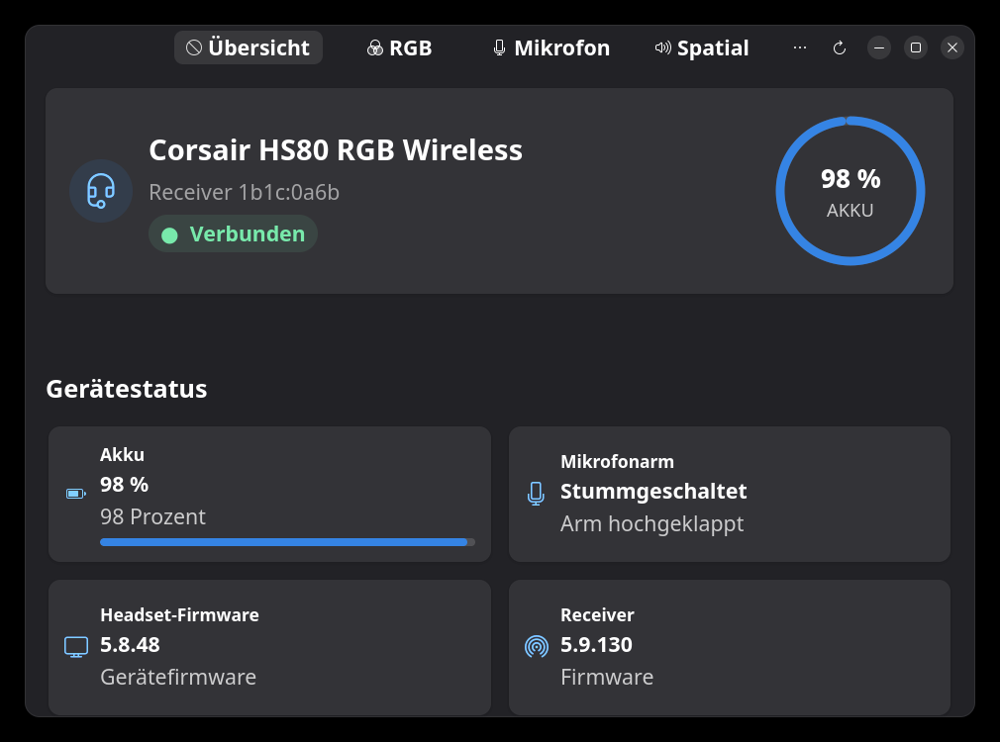
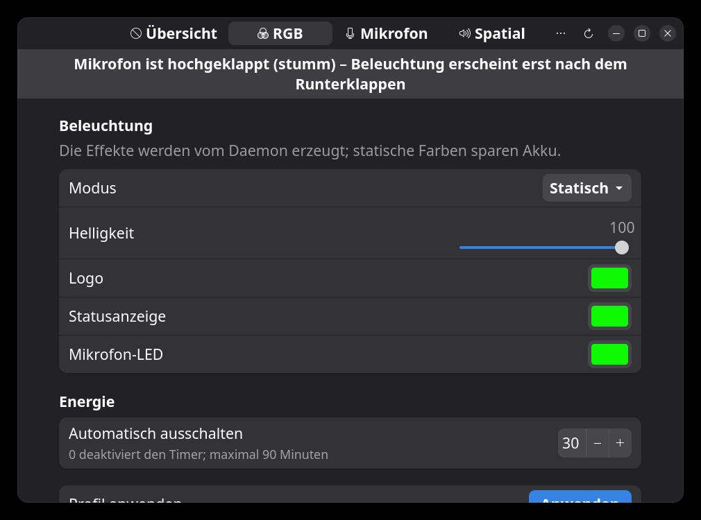
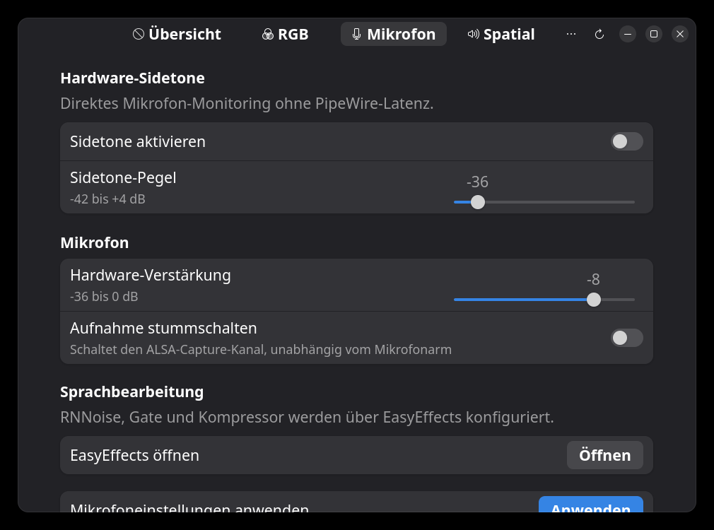
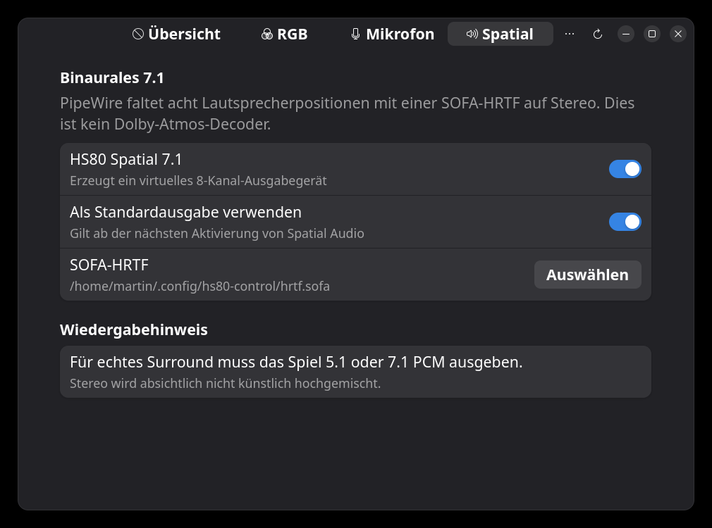

# HS80 Control

[](https://github.com/ST1CKEL/HS80_Control/actions/workflows/check.yml)
[](LICENSE)
[](https://www.python.org/)
[](https://fedoraproject.org/)

Native Linux-Steuerung für das **Corsair HS80 RGB Wireless** — kabellos über den
USB-Empfänger `1b1c:0a6b` oder direkt am USB-Kabel (`1b1c:0a69`), ganz ohne
Dongle. Akku, Beleuchtung, Sidetone, Mikrofon und binaurales 7.1 ohne iCUE und
ohne Windows.

Das Projekt besteht aus einem Benutzerdienst, einer D-Bus-API, einem
Kommandozeilenprogramm und einer GTK4/libadwaita-Oberfläche, die den
Systemfarben folgt und unter Wayland wie X11 läuft.

```bash
hs80ctl status                      # Akku, Firmware, Verbindungsart
hs80ctl rgb static --logo '#00bfff' # Beleuchtung setzen
hs80ctl reconnect                   # Funkverbindung neu aufbauen
```

> Kein offizielles Corsair-Produkt. Das Protokoll wurde aus öffentlich
> verfügbaren Arbeiten und eigenen Messungen an echter Hardware rekonstruiert;
> Einzelheiten in [docs/PROTOCOL.md](docs/PROTOCOL.md).

## Screenshots

Die Oberfläche folgt den Systemfarben für hell und dunkel; die Aufnahmen
entstehen unter KDE Plasma mit dunklem Schema.

| Übersicht | RGB |
| --- | --- |
|  |  |

| Mikrofon | Spatial |
| --- | --- |
|  |  |

## Systemanforderungen

| Komponente | Anforderung |
| --- | --- |
| Hardware | Corsair HS80 RGB Wireless, über Receiver `1b1c:0a6b` (interne Headset-PID `0a69` bestätigt, `0a71` experimentell) oder direkt am USB-Kabel als `1b1c:0a69` |
| Betriebssystem | Linux mit systemd-Benutzersitzung; entwickelt und getestet auf Fedora 44 |
| Python | 3.11 oder neuer |
| Grafik | GTK 4 und libadwaita ≥ 1.7 (Fedora 44 liefert 1.9); Wayland und X11 |
| Audio | PipeWire mit WirePlumber (Spatial Audio zusätzlich `pipewire-module-filter-chain-sofa`) |
| HID-Zugriff | `hidapi` (hidraw-Backend) plus die mitgelieferte udev-Regel für Interface 3 beider Kennungen |
| Mixer | `alsa-utils` für Sidetone, Mikrofon-Gain und Aufnahmestummschaltung |
| Optional | EasyEffects für RNNoise, Gate und Kompressor |

Die Benutzeroberfläche reagiert adaptiv: ab einer Fensterbreite von 600 sp
wechselt der Umschalter in der Kopfzeile auf eine Leiste am unteren Rand.
libadwaita 1.9 hat die Eigenschaft `revealed` von `AdwViewSwitcherBar` zu
`reveal` umbenannt; der Code unterstützt beide Namen und läuft deshalb mit
libadwaita 1.7 bis 1.9+.

## Hardware-Kompatibilität

HS80 Control unterstützt gezielt die folgende Hardware und nicht pauschal die
gesamte HS80-Produktfamilie:

| Variante | Kennungen | Status |
| --- | --- | --- |
| HS80 RGB Wireless über den Receiver | Receiver `1b1c:0a6b`, interne Headset-PID `0a69` | Unterstützt und an echter Hardware bestätigt |
| HS80 RGB Wireless am USB-Kabel, eingeschaltet | Headset `1b1c:0a69` direkt | Unterstützt und an echter Hardware bestätigt; kein Receiver nötig |
| HS80 RGB Wireless am USB-Kabel, ausgeschaltet | Headset `1b1c:0a6a` direkt | Wird erkannt und als Ladezustand gemeldet; bietet weder Audio noch Steuerprotokoll |
| HS80 RGB Wireless mit alternativer interner PID | Receiver `1b1c:0a6b`, interne Headset-PID `0a71` | Im Code experimentell berücksichtigt; diese Kombination ist nicht an Hardware bestätigt |
| HS80 MAX sowie Xbox- oder Bluetooth-Varianten | anderer oder kein kompatibler Receiver | Nicht unterstützt |
| HS80 mit einer anderen Receiver-USB-ID | weder `1b1c:0a6b` noch `1b1c:0a69` | Nicht unterstützt |

Im Funkbetrieb wird die interne Headset-PID über den Receiver abgefragt; das
Headset erscheint dann nicht separat in `lsusb`. Am Kabel meldet es sich
dagegen als eigenes USB-Gerät, dessen ID vom Einschaltzustand abhängt — die
Messwerte dazu stehen in [docs/PROTOCOL.md](docs/PROTOCOL.md). Sondereditionen
sind nur dann voraussichtlich kompatibel, wenn sie dieselben Kennungen
verwenden. Ein erster lokaler Infrastrukturtest ist:

```bash
hs80ctl doctor
```

`doctor` prüft Receiver, Zugriffsrechte, ALSA und PipeWire, aber nicht allein
die interne Headset-PID. Vollständig bestätigt ist die Kombination erst, wenn
der laufende Daemon das Headset nach seiner PID-Prüfung als verbunden meldet:

```bash
hs80ctl status
```

Mehrere gleichzeitig angeschlossene kompatible Receiver werden noch nicht
unterstützt. Der Daemon verwendet den zuerst gefundenen Receiver; Spatial
Audio bricht bei mehreren passenden physischen PipeWire-Sinks mit einer
eindeutigen Fehlermeldung ab.

## Funktionen

- Akku, Verbindung, Firmware und physischer Mikrofonstatus
- RGB aus, statisch, pulsierend oder Regenbogen
- getrennte Farben für Logo, Statusanzeige und Mikrofon-LED
- automatische Abschaltung von 0 bis 90 Minuten
- Hardware-Sidetone über ALSA, `-42` bis `+4 dB`
- Mikrofonverstärkung über ALSA, `-36` bis `0 dB`
- ALSA-Aufnahmestummschaltung
- optionales binaurales PipeWire-7.1 mit einer SOFA-HRTF
- sichere Hotplug-, Standby- und Wiederverbindungsbehandlung
- Reconnect auf Knopfdruck, baut die Receiver-Sitzung neu auf und sucht das
  Headset
- erkennt ein Headset am USB-Ladekabel und erklärt, warum darüber kein Ton
  läuft

Audio und Mikrofon bleiben beim Kernelmodul `snd-usb-audio`. Der Dienst öffnet
nur HID-Interface 3 und trennt keine USB- oder Audio-Treiber.

### Reconnect statt Pairing

Der Reconnect in der Kopfleiste und `hs80ctl reconnect` verwerfen die
bestehende HID-Sitzung, öffnen den Receiver neu und fragen die aktiven
Funkkanäle erneut ab. Das ist der richtige Griff, wenn das Headset erst nach
dem Start des Dienstes eingeschaltet wurde oder die Sitzung hängt, und wirkt
sofort statt erst beim nächsten Heartbeat.

Es ist ausdrücklich **kein** erneutes Funk-Pairing: Receiver und Headset
werden ab Werk gekoppelt ausgeliefert, und der dafür nötige Befehl ist in
keiner der in [docs/PROTOCOL.md](docs/PROTOCOL.md) genannten Quellen
dokumentiert. Ein echtes Neukoppeln bleibt iCUE vorbehalten. Pairing und
Firmware-Updates werden deshalb weiterhin absichtlich nicht angeboten.

### Betrieb am USB-Kabel

Das Headset meldet sich am Kabel je nach Zustand als **zwei verschiedene
Geräte**:

| Zustand | USB-ID | Schnittstellen | Audio | Steuerung |
| --- | --- | --- | --- | --- |
| eingeschaltet | `1b1c:0a69` | 4 | ja, eigene ALSA-Karte | ja, `0xff42` |
| ausgeschaltet | `1b1c:0a6a` | 1 | nein | nein |

Eingeschaltet läuft alles ohne Dongle: Ton, Akku, Firmware, Mikrofonstatus,
RGB, Sidetone und Mikrofonverstärkung. Der Dienst bevorzugt dieses Gerät, wenn
Kabel und Receiver gleichzeitig stecken. Die udev-Regel gibt dafür zusätzlich
`0a69` Interface 3 frei; Audio bleibt unangetastet bei `snd-usb-audio`.

Ausgeschaltet lädt das Headset nur. Es bietet dann eine einzige
HID-Schnittstelle bei 150 mA mit Vendor-Page `0xff58` und den Lautstärketasten,
aber keine Audioklasse und kein `0xff42`. Die App erkennt auch diesen Zustand
und benennt ihn, statt bloß „offline" zu melden.

Ein Detail aus der Messung: Der Heartbeat `12` wird im Direktbetrieb nicht
beantwortet und brachte das Gerät bei Wiederholung zum Zurücksetzen. Der Dienst
sendet ihn dort deshalb nicht — Einzelheiten in
[docs/PROTOCOL.md](docs/PROTOCOL.md).

## Voraussetzungen

Die benötigten Laufzeitpakete sind auf Fedora 44 normalerweise bereits
vorhanden:

```bash
sudo dnf install python3 python3-dbus-next python3-gobject gtk4 libadwaita \
  hidapi alsa-utils pipewire pipewire-utils wireplumber
```

Für Spatial Audio zusätzlich:

```bash
sudo dnf install pipewire-module-filter-chain-sofa
```

EasyEffects ist optional und wird für RNNoise, Gate und Kompressor des
Mikrofons empfohlen.

## Oberfläche

Die GTK-Anwendung `hs80-control` gliedert sich in vier Seiten, die über den
Umschalter in der Kopfzeile erreichbar sind:

- **Übersicht** — Verbindungszustand als farbige Plakette, Akkuring mit
  Prozentanzeige (unter 20 % rot, beim Laden grün), Statuskarten für Akku,
  Mikrofonarm, Headset- und Receiver-Firmware sowie die Schnellaktion zum
  Ausschalten der Beleuchtung. Fehler des Dienstes, der Audio-Infrastruktur
  oder von Spatial Audio erscheinen als eigene Banner.
- **RGB** — Modus (Aus, Statisch, Pulsieren, Regenbogen), Helligkeit,
  getrennte Farben für Logo, Statusanzeige und Mikrofon-LED sowie der
  Sleep-Timer. Ist der Mikrofonarm hochgeklappt, zeigt ein Banner, dass die
  Firmware Software-Beleuchtung in diesem Zustand unterdrückt; das Profil
  wird beim Herunterklappen automatisch angewendet.
- **Mikrofon** — Hardware-Sidetone mit Regler, Mikrofon-Gain,
  Aufnahmestummschaltung und der Sprung zu EasyEffects.
- **Spatial** — binaurales 7.1 mit SOFA-HRTF, Standardausgabe-Wahl und
  Wiedergabehinweisen.

Statusmeldungen nach dem Anwenden erscheinen als Kurzmitteilungen (Toasts).
Das Menü in der Kopfzeile öffnet den Dialog »Über HS80 Control«.

## Prüfen

```bash
make check
./bin/hs80ctl doctor
```

`doctor` prüft USB-Gerät, hidraw-Berechtigungen, ALSA-Regler, PipeWire-Sink und
das SOFA-Modul. Vor der Installation meldet `/dev/hidraw*` erwartungsgemäß
fehlende Rechte.

## Benutzerinstallation

Die Anwendung und die systemd-User-Dienste benötigen keine Root-Rechte:

```bash
make install-user
```

Eine Benutzerinstallation wird mit `make uninstall-user` wieder entfernt. Die
persönliche Konfiguration und ausgewählte SOFA-Dateien bleiben dabei erhalten.
Die separat systemweit installierte udev-Regel wird absichtlich nicht durch
dieses Benutzerziel verändert.

Nur die eng begrenzte udev-Regel muss systemweit installiert werden:

```bash
sudo install -Dm0644 data/udev/70-hs80-control.rules \
  /usr/lib/udev/rules.d/70-hs80-control.rules
sudo udevadm control --reload-rules
```

Danach den Receiver einmal abziehen und wieder einstecken. Anschließend:

```bash
systemctl --user restart hs80d.service
hs80ctl status
hs80-control
```

`~/.local/bin` muss im `PATH` liegen. Unter Fedora ist dies nach einer normalen
Anmeldung üblicherweise der Fall.

## Systeminstallation

Alternativ kann das Projekt systemweit installiert werden:

```bash
sudo make install
sudo udevadm control --reload-rules
systemctl --user daemon-reload
```

D-Bus startet `hs80d` bei Bedarf automatisch. Ein dauerhaft aktivierter Dienst
ist daher optional:

```bash
systemctl --user enable --now hs80d.service
```

Der systemweite Installationspfad ist bewusst auf `/usr` festgelegt, weil die
Starter, D-Bus-Aktivierung und systemd-Units gemeinsam darauf verweisen. Für
Paket-Builds kann weiterhin ohne Host-Änderungen gestaged werden, zum Beispiel
mit `make install DESTDIR="$PWD/stage"`. Ein abweichendes `PREFIX` wird mit einer
erklärenden Fehlermeldung abgewiesen.

## Direkt aus dem Quellverzeichnis

```bash
./bin/hs80d
./bin/hs80-control
```

In einem zweiten Terminal können Befehle ausgeführt werden:

```bash
./bin/hs80ctl status
./bin/hs80ctl reconnect
./bin/hs80ctl rgb off
./bin/hs80ctl rgb static --brightness 35 --logo '#00bfff'
./bin/hs80ctl sidetone on --db -20
./bin/hs80ctl mic-gain -6
./bin/hs80ctl mic-mute off
./bin/hs80ctl sleep 15
```

Für Skripte liefert `hs80ctl status --json` den vollständigen D-Bus-Zustand.
Auch Antworten anderer Befehle und Fehler werden mit `--json`
maschinenlesbar ausgegeben; die Option funktioniert vor oder nach dem
Unterbefehl.

## Spatial Audio

Das Headset ist physisch ein Stereo-Gerät. HS80 Control erzeugt ein virtuelles
7.1-Gerät und faltet dessen acht Kanäle mit einer SOFA-HRTF auf Stereo. Eine
SOFA-Datei wird wegen unterschiedlicher Datensatzlizenzen nicht mitgeliefert.

```bash
hs80ctl spatial configure ~/HRTF/meine-hrtf.sofa
hs80ctl spatial default on
hs80ctl spatial on
```

Danach erscheint `HS80 Spatial 7.1` in Plasma. Das Programm setzt es auf Wunsch
als Standardausgabe. Mit `hs80ctl spatial default off` bleibt dagegen die
bisherige Ausgabe ausgewählt. Diese Voreinstellung gilt bei der nächsten
Aktivierung; ein laufender Spatial-Dienst kann dafür kurz mit `spatial off` und
`spatial on` neu aktiviert werden. Spiele müssen 5.1 oder 7.1 PCM ausgeben;
Stereo wird nicht künstlich hochgemischt. Diese Funktion ist generisches
HRTF-Audio und kein Dolby-Atmos-Decoder.

## Mikrofonbearbeitung

Hardware-Gain, Mute und Sidetone sind direkt integriert. Für Softwareeffekte
öffnet die Oberfläche EasyEffects. Eine sinnvolle Startreihenfolge ist:

1. Hochpass bei 70 bis 100 Hz
2. RNNoise mit moderater Sprachaktivitätserkennung
3. sanfter Expander statt hartem Gate
4. Kompressor mit ungefähr 2:1 bis 3:1
5. Limiter bei ungefähr -1 dBFS

Rauschunterdrückung und automatische Verstärkung sollten nicht gleichzeitig
noch einmal in Discord oder einer anderen Sprachsoftware aktiviert werden.

## Konflikte

Nur ein Programm darf das Corsair-HID-Kontrollinterface besitzen. OpenLinkHub,
OpenRGB, ckb-next oder iCUE in einer VM müssen für dieses Gerät beendet sein,
bevor `hs80d` gestartet wird. Der normale Kernelzugriff auf Audio, Lautstärke
und Tasten bleibt davon unberührt.

## Dateien

- Konfiguration: `~/.config/hs80-control/config.json`
- generierter PipeWire-Graph: `~/.config/hs80-control/pipewire.conf`
- User-Dienst: `hs80d.service`
- Spatial-Dienst: `hs80-spatial.service`
- D-Bus: `io.github.hs80control.Daemon`

Technische Details stehen in [docs/ARCHITECTURE.md](docs/ARCHITECTURE.md) und
[docs/PROTOCOL.md](docs/PROTOCOL.md).

## Release und Paketbau

Die kanonische Version steht in `src/hs80_control/__init__.py`. `make check`
vergleicht sie mit RPM-Spec und neuestem AppStream-Release. Ein reproduzierbares
Quellarchiv mit normalisierten Zeitstempeln, Besitzern, Rechten, Reihenfolge und
gzip-Header entsteht so:

```bash
make dist
mkdir -p build/rpmbuild/{BUILD,BUILDROOT,RPMS,SOURCES,SPECS,SRPMS,tmp}
rpmbuild -ba packaging/hs80-control.spec \
  --define "_topdir $PWD/build/rpmbuild" \
  --define "_tmppath $PWD/build/rpmbuild/tmp" \
  --define "_sourcedir $PWD/dist"
```

Für die lokalen Prüfungen werden zusätzlich `make`, `desktop-file-utils`,
`appstream`, `libxml2`, `systemd`, `systemd-udev`, `pipewire-utils` und
`python3-dbus-next` benötigt; Archiv und RPM-Bau verwenden außerdem `tar`,
`gzip` und `rpm-build`. Das RPM-Spec deklariert seine Build- und
Prüfabhängigkeiten und führt in `%check` ebenfalls `make check` aus.

Quellcode und Releases liegen unter
[github.com/ST1CKEL/HS80_Control](https://github.com/ST1CKEL/HS80_Control);
Fehlerberichte gehören in den dortigen
[Issue-Tracker](https://github.com/ST1CKEL/HS80_Control/issues). Die bestehende
App-ID `io.github.hs80control.App` bleibt vorerst absichtlich unverändert:
AppStream meldet wegen des großen `A` einen rein pedantischen Hinweis. Eine
Umstellung auf Kleinbuchstaben muss koordiniert in Programmcode, Desktop-Datei,
Metainfo, Iconnamen und bestehenden Benutzerinstallationen erfolgen.

## Lizenz

HS80 Control steht unter `GPL-3.0-or-later`. Der vollständige Lizenztext liegt
in [LICENSE](LICENSE). Nur die AppStream-Metadaten sind, wie dort
vorgeschrieben, separat unter `CC0-1.0` freigegeben; der vollständige Text liegt
in [LICENSE.CC0](LICENSE.CC0). Projektspezifische Hinweise und Drittnamen stehen
in [NOTICE](NOTICE).

## Sicherheit und Haftung

Das Protokoll wurde unabhängig durch Analyse öffentlich dokumentierter
Implementierungen rekonstruiert. Die Software ist nicht mit Corsair verbunden.
Sie enthält keine Firmware- oder Pairing-Kommandos. Nutzung erfolgt ohne
Gewährleistung und auf eigenes Risiko.
