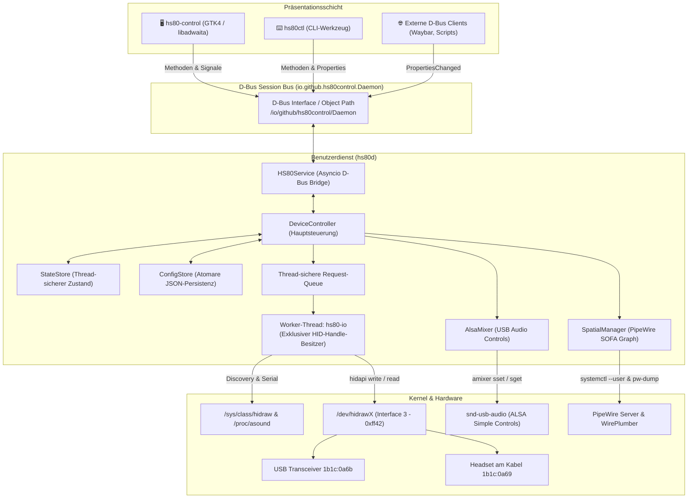
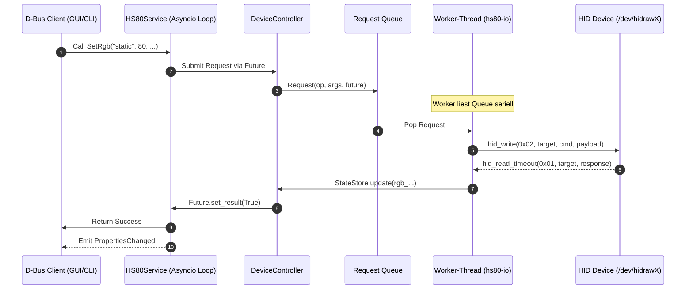
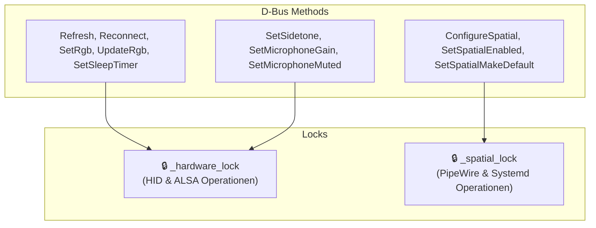

# Architektur von HS80 Control

Dieses Dokument beschreibt den internen Aufbau, das Threading-Modell, die Zustandsverwaltung und die Sicherheitsgrenzen von **HS80 Control**.

---

## 1. Prozess- und Komponentenübersicht

`hs80d` läuft vollständig in der unprivilegierten Benutzersitzung (`systemd --user`). Dadurch kann der Dienst gleichzeitig auf:
- die durch `uaccess` freigegebene hidraw-Gerätedatei,
- die ALSA-Kartenregler des Benutzers und
- den PipeWire-Audio-Server der Benutzersitzung

zugreifen, ohne jemals Root-Rechte oder polkit-Eskalationen zu benötigen.

---

## 2. Threading-Modell & HID-Serialisierung

### Warum ein exklusiver Worker-Thread?

Im Corsair Bragi-Protokoll teilen sich Receiverkommandos, Headsetkommandos, RGB-Frames, Heartbeats und spontane Hardware-Ereignisse (wie Akku- oder Mute-Meldungen) **denselben gemeinsamen USB-HID-Handle**.

Würden mehrere Threads gleichzeitig auf dem Handle lesen oder schreiben:
1. Könnten Antworten auf Konfigurationskommandos von einem anderen Thread abgefangen werden.
2. Könnte ein periodischer Heartbeat eine RGB-Frame-Antwort überholen.
3. Würden Timeouts und Stream-Desynchronisationen auftreten.

Deshalb besitzt **ausschließlich der Thread `hs80-io`** das offene HID-Handle.

### Aufgaben des Worker-Threads

1. **USB-Hotplug & Discovery**: Überwachung von Sysfs nach dem Receiver `1b1c:0a6b` oder direkt angeschlossenem Headset `1b1c:0a69`.
2. **Initialisierung**: Umschaltung in den Softwaremodus (`01 03 00 02`) und Ermittlung gekoppelter Endpunkte.
3. **Queue-Abarbeitung**: Serielles Ausführen von Benutzerkommandos mit Bestätigung über `concurrent.futures.Future`.
4. **Heartbeat-Zyklus**: Periodische Abfrage alle 10 Sekunden zur Erkennung von Verbindungsabbrüchen.
5. **Event-Dispatching**: Verarbeitung spontaner Report-ID-`0x03`-Events (Akkustand, Ladezustand, Mikrofon-Arm-Schalter).
6. **RGB-Animationen**: Taktung von dynamischen Effekten (*Pulse*, *Rainbow*) mit bis zu 25 Frames pro Sekunde.
7. **Clean Teardown**: Sichere Rückversetzung von Headset und Dongle in den Hardwaremodus (`01 03 00 01`) beim Beenden des Dienstes.

---

## 3. D-Bus-Architektur & Unabhängige Lock-Domänen

Um zu verhindern, dass langwierige Operationen (wie das Starten von PipeWire-Diensten oder Laden großer SOFA-Dateien) die reaktionsschnelle Steuerung von Lautstärke, Mute oder RGB blockieren, trennt `HS80Service` die Aufrufe in getrennte Asyncio-Locks:

- **Hardware-Lock**: Schnelle HID- und ALSA-Befehle werden unmittelbar an die Worker-Queue übergeben.
- **Spatial-Lock**: PipeWire-Konfigurationsänderungen, `systemctl --user`-Neustarts und Sink-Wartezyklen laufen isoliert im Spatial-Lock.

---

## 4. Persistenz & Konfigurationsintegrität

Die Konfiguration wird in `~/.config/hs80-control/config.json` verwaltet:

1. **Atomares Schreiben**: Konfigurationsdateien werden zunächst in eine temporäre Datei im selben Verzeichnis geschrieben, via `os.fsync()` synchronisiert und mittels `os.replace()` atomar ausgetauscht.
2. **Rechteabsicherung**: Das Verzeichnis `~/.config/hs80-control/` wird strikt mit Modus `0700` angelegt, Dateien mit `0600`.
3. **Rollback-Fähigkeit**: Schlägt das Aktivieren einer neuen SOFA-HRTF-Konfiguration fehl, stellt `SpatialManager` die vorherige funktionierende Konfiguration und die WirePlumber-Standardausgabe automatisch wieder her.

---

## 5. Sicherheitsgrenzen

- **Striktes udev-Scoping**: Die udev-Regel gewährt ausschließlich Zugriff auf Interface 3 (Vendor-Usage-Page `0xff42`).
- **Kernel-Treiber unberührt**: USB Audio Interfaces 0, 1, 2 und HID-Tasten Interface 4 verbleiben vollständig bei `snd-usb-audio` und `hid-generic`.
- **Keine invasiven Kommandos**: Der Quellcode enthält bewusst keinerlei Firmware-Flash- oder Neukoppelungs-(Pairing-)Befehle, um ein Bricken der Hardware auszuschließen.
- **Isolierter Socket**: Keine Netzwerk-Sockets, keine Telemetrie, D-Bus nur auf dem lokalen Benutzer-Session-Bus.
