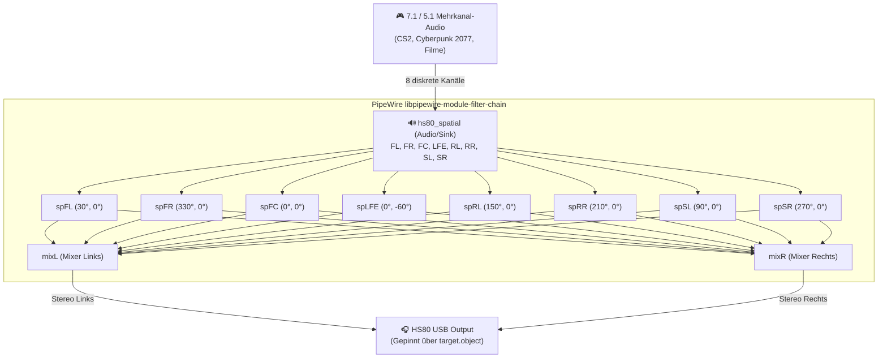

# Binaurales 7.1 Spatial Audio mit PipeWire & SOFA HRTF

**HS80 Control** ermöglicht echtes 3D-Binaural-Audio auf dem Corsair HS80 RGB Wireless unter Linux, indem ein virtuelles 8-Kanal-Surround-Gerät erzeugt und in Echtzeit über eine **Head-Related Transfer Function (HRTF)** im standardisierten SOFA-Format auf die Stereo-Kopfhörertreiber gefaltet wird.

---

## 1. Wie Spatial Audio funktioniert



### Lautsprecher-Positionen im 7.1 Raum

| Kanal | Bezeichnung | Azimut (Winkel) | Elevation (Höhe) |
| :--- | :--- | :---: | :---: |
| **FL** | Front Left | `30.0°` | `0.0°` |
| **FR** | Front Right | `330.0°` | `0.0°` |
| **FC** | Front Center | `0.0°` | `0.0°` |
| **LFE** | Low-Frequency Effects (Subwoofer) | `0.0°` | `-60.0°` |
| **SL** | Side Surround Left | `90.0°` | `0.0°` |
| **SR** | Side Surround Right | `270.0°` | `0.0°` |
| **RL** | Rear Surround Left | `150.0°` | `0.0°` |
| **RR** | Rear Surround Right | `210.0°` | `0.0°` |

---

## 2. Bezugsquellen für SOFA-HRTF-Dateien

SOFA-Dateien erfassen die akustischen Filterkurven des menschlichen Kopfes und der Ohrmuscheln. Da die Wahrnehmung von Person zu Person variiert, lohnt es sich, verschiedene Datensätze auszuprobieren:

1. **SADIE II Database (University of York)**:
   - Hochwertige Messungen an Kunstköpfen (z. B. KEMAR) und menschlichen Probanden.
   - Download: <https://www.york.ac.uk/sadie-project/database.html>
   - Empfohlene Datei: `D1_48K_24bit_256tap_FIR_SOFA.sofa` (KEMAR Kunstkopf)

2. **SOFA Conventions Community Datasets**:
   - Übersicht standardisierter HRTF-Messungen: <https://www.sofaconventions.org/>

3. **MIT KEMAR HRTF Dataset**:
   - Der klassische Industriestandard für Dummy-Head-Messungen.

---

## 3. Konfiguration & Aktivierung

### Über die grafische Oberfläche (`hs80-control`)
1. Öffnen Sie die Registerkarte **Spatial**.
2. Klicken Sie bei **SOFA-HRTF** auf **Auswählen** und wählen Sie Ihre `.sofa`-Datei.
3. Aktivieren Sie den Schalter **HS80 Spatial 7.1**.

### Über das Terminal (`hs80ctl`)
```bash
# 1. SOFA-Datei konfigurieren
hs80ctl spatial configure ~/Downloads/kemar.sofa

# 2. Automatische Standardausgabe aktivieren
hs80ctl spatial default on

# 3. Spatial Audio starten
hs80ctl spatial on
```

---

## 4. Spiele & Anwendungen optimal einstellen

Damit Sie echten 3D-Raumklang hören, muss die Audioquelle Mehrkanalton an PipeWire liefern:

1. **Im Spiel**:
   - Wählen Sie in den Audiooptionen **7.1 Lautsprecher**, **5.1 Lautsprecher** oder **Surround**.
   - Wählen Sie **nicht** »Kopfhörer« oder ein spielinternes »3D Audio«, da das Spiel den Ton sonst selbst vorab auf Stereo zusammenmischt.
2. **Stereo-Musik & YouTube**:
   - Stereo-Inhalte werden unverändert links und rechts wiedergegeben; es findet bewusst kein künstliches Up-Mixing statt, um Verfälschungen des Originaltons zu vermeiden.
